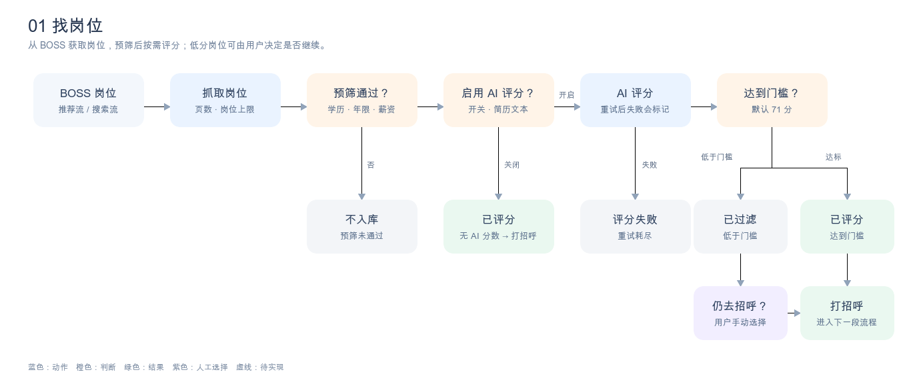
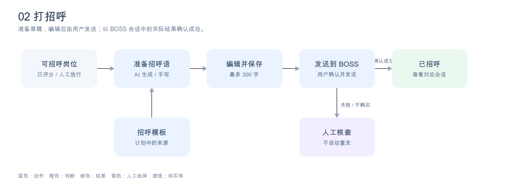
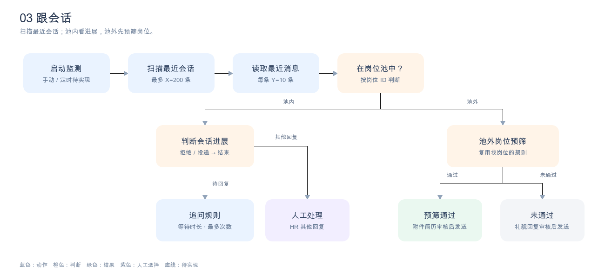
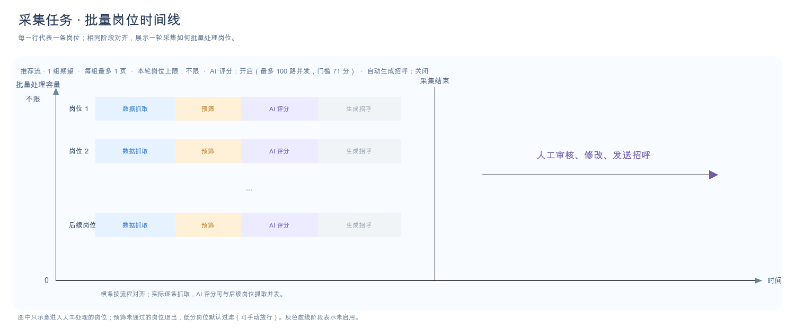

# 工作台：工作流配置与预览

工作台以「找岗位 → 打招呼 → 跟会话」为导航。每段展示一张简图；点击图中的节点，旁边展示该节点的作用、当前配置值和可修改的配置。可编辑项保存后影响下一轮任务，图的预览随选择变化，但预览不会启动任务。没有配置的节点只展示规则或单条操作。高级选项仍由独立的「配置」页承接。

「历史任务与执行情况」「待办事项」暂留空白，不纳入本次流程设计。

以下用「现有」表示项目已有能力，用「待实现」表示讨论确定但尚未接入的能力，用「待定」表示规则还需明确。

## 1. 找岗位

预筛只有「通过 / 不通过」。图中的「已过滤」专指预筛通过、AI 评分低于门槛的岗位；它已入岗位池，可由用户手动选择仍去招呼。预筛未通过的岗位目前不会入库，因此没有这个人工入口。

| 节点 | 点击后显示的配置与含义 | 当前情况 |
| --- | --- | --- |
| F1 岗位来源 | `collection.mode`：推荐流或搜索流。推荐流用 `encrypt_expect_id` 指定求职期望；搜索流用 `keywords` 指定搜索词。`city/city_code` 限定城市，`sort` 控制搜索流排序；`collection.platform` 当前固定为 BOSS。 | 现有；工作台基础配置已支持模式、ID、关键词。 |
| F2 抓取岗位 | `collection.max_pages`：每个搜索组合最多抓取的页数，默认 1；`max_jobs`：本轮岗位上限，0 为不限。`browser.cdp_url`：连接已登录 Chrome 的地址。每日列表页和详情页上限、请求间隔与风险暂停属于高级配置。 | 配置现有；工作台目前只开放 Chrome 地址，其他项需要接入节点面板。 |
| F3 预筛 | 节点面板先开放 `profile.education`、`experience_filters`、`recruitment_types`、`salary_min/max`，分别控制学历、经验、招聘类型、薪资范围。配置页再提供 `company_sizes`（公司规模）、`filter_unparsed_salary`（排除面议或无法解析的薪资）、`deal_breakers`（职位名排除词）、`jd_deal_breakers`（JD 排除词）、`blocked_companies`（公司名排除词）、`exclude_headhunter`（排除猎头）。空列表或 0 依字段含义表示不限。 | 规则现有；工作台节点编辑入口待实现。 |
| F4 AI 评分 | `ai.use_ai_score`：是否评分；`profile.resume_path`：供评分读取的简历文本。模型、API Key 环境变量、超时、随机等待与重试次数属于高级配置。 | 规则现有；调用重试后仍失败会标记「评分失败」。 |
| F5 评分门槛 | `ai.score_threshold`：多少分及以上视为达标，默认 71；低于门槛进入「已过滤」。仅在 AI 评分开启时生效。 | 规则现有；工作台节点编辑入口待实现。 |
| F6 人工选择 | 对低分已过滤岗位点击「仍去招呼」，进入打招呼阶段。 | 现有；这是单个岗位的操作，不是全局配置。 |
| F7 打招呼 | 打开下一段流程；本节点没有独立配置。 | 现有。 |

预筛通过的岗位可以一边继续抓取下一条，一边提交 AI 评分任务；评分结果在本轮采集结束前汇总入库。

## 2. 打招呼

「保存」只保存草稿；「发送招呼」会连同当前文本保存。发送成功后岗位才变为「已招呼」，后续由监测任务扫描会话。结束流程是岗位上的常驻操作，不需要加入招呼语主路径。

| 节点 | 点击后显示的配置与含义 | 当前情况 |
| --- | --- | --- |
| G1 进入打招呼 | 展示岗位的预筛、AI 分数和是否由用户人工放行；没有独立配置。 | 现有。 |
| G2 草稿来源 | `ai.use_ai_greeting`：是否在采集时为达到评分门槛的岗位自动生成招呼语，默认关闭，且依赖 `ai.use_ai_score`。用户也可在岗位详情中手动触发 AI 生成或自行填写。模板来源目前没有可用配置。 | AI 和手写现有；工作台开关入口和招呼模板待实现。 |
| G3 编辑与保存 | 招呼语最多 300 字；保存后仍可继续编辑。字数是固定规则，不设工作台配置。 | 现有。 |
| G4 发送与确认 | 使用同一个 `browser.cdp_url` 连接 BOSS；发送前由用户确认内容。系统只在对应会话核实到消息后认定成功。 | 现有；没有自动发送开关。 |
| G5 已招呼 | 展示已发送的文字和「查看会话」入口；没有独立配置。 | 现有。 |

## 3. 跟会话

「未读」和「已读未回」指我方最新发出的消息是否被招聘者读过、是否收到回复；两者共用同一组追问规则。HR 回复后如果既非明确拒绝，也没有附件简历已投递的证据，先交用户判断。会话可以反复变化，只有明确拒绝、简历投递或用户强制结束才自动或人工结束流程。

| 节点 | 点击后显示的配置与含义 | 当前情况 |
| --- | --- | --- |
| M1 启动 | 手动启动可用。此前约定每天 10:00 启动一轮监测，时间可配置；错过时间时提示用户选择补跑或放弃。定时配置尚无实际字段。 | 手动启动现有；定时启动待实现。 |
| M2 扫描范围 | `monitoring.followup_days`：扫描「仅沟通」中最近活动多少天的会话。 | 现有；配置页已开放。 |
| M3 读取消息 | `monitoring.message_limit`：每条会话读取最近多少条消息，默认 10。 | 现有；工作台基础配置已开放。 |
| M4 岗位池归属 | 根据会话关联的岗位 ID 查询岗位池。 | 现有判断；池外后续处理待实现。 |
| M5 会话判断 | 明确拒绝、BOSS 附件简历已发送确认、我方最新消息待回复、其他人工处理。判断依据应在会话详情中展示。 | 基础判断现有；区分「未读 / 已读未回」尚未实现。 |
| M6 追问规则 | 同一组「等待时长」和「最多追问次数」同时作用于未读、已读未回；次数通常设 1～2 次，但默认值尚未确定。达到条件后只生成待审核草稿，审核通过才发送。 | 配置字段、计数、生成与发送均待实现。 |
| M7 人工处理 | 用户查看会话和判断依据后决定下一步；这是逐条操作，没有全局自动决策开关。 | 当前仅有人工处理标记。 |
| M8 池外岗位 | 复用 F3 的预筛规则。通过后入岗位池并标记监测中，附件简历经审核后发送；未通过则生成礼貌拒绝回复，经审核后发送。附件文件路径须与 `profile.resume_path` 的 AI 用文本简历分开配置。 | 整条处理分支待实现。 |

流程节点在工作台负责解释和配置；采集任务页、监测任务页负责启动任务与查看当轮结果。历史任务与待办模块保持空白，待规则确定后再设计。

## 4. 批量任务工作流预览

前三张图解释单条岗位或会话如何处理；采集预览用「批量处理容量 × 时间」表示一轮任务。每一行是一条岗位，四个阶段按列对齐，便于看出整批岗位经历的数据抓取、预筛、AI 评分和生成招呼。对齐是流程示意，不表示所有岗位同时抓取；实际逐条抓取时，AI 评分可以与后续岗位抓取并发。未开启的 AI 阶段保留为灰色虚线框。采集结束线右侧只用一条箭头表示整批岗位后续的人工审核、修改与发送招呼，不在每行重复画人工操作。

监测仍是独立启动的另一轮任务，工作台另用批量会话流程图展示最近会话的逐条读取、判断和回写。它会读到岗位池外的会话；追问、附件简历和礼貌回复的审核发送仍以虚线标记为规划能力。去重只作为内部规则，不占用户可见节点。

工作台的「生成预览图」读取**已保存**的配置值，呈现采集来源、页数及岗位上限、AI 开关与最大并发数、招呼语生成方式，以及监测扫描的会话数和每条消息数。保存配置后预览更新，两张图分别可下载 SVG。预览图不代表任务正在运行或已经完成。采集设计稿可运行 `python3 design/generate_collection_timeline.py` 根据当前项目配置重新生成 SVG。
